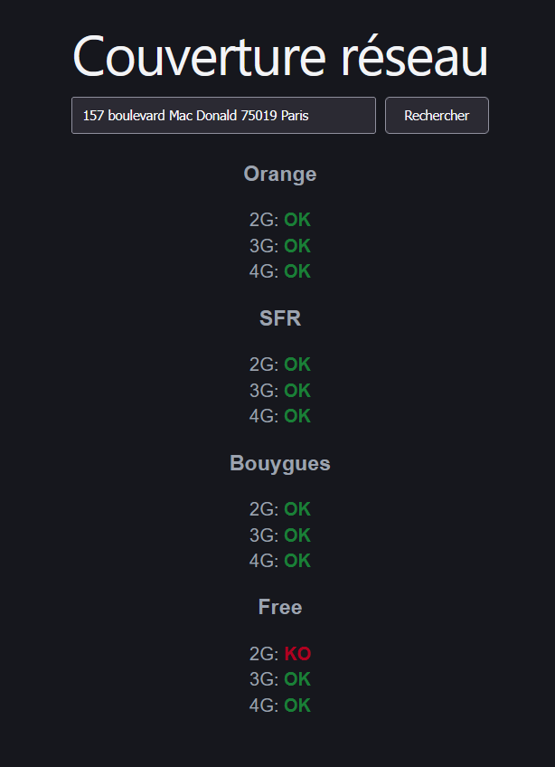

# Network Coverage API
API backend + interface web  qui calcule, pour une ou plusieurs adresses, la couverture réseau 2G/3G/4G par opérateur (le frontend ne le fait que pour une seule adresse, mais l'API peut traiter plusieurs adresses en un seul appel).


.

## Sommaire
- [Get started](#get-started)
- [Choix des technologies](#choix-des-technologies)
- [Explications techniques supplémentaires](#explications-techniques-supplémentaires)
## Get started
### Prérequis
- Python 3.12+
- [uv](https://docs.astral.sh/uv/)
- Node.js 20.18+ et npm (frontend)

### Backend
```bash
cd backend
uv sync
uv run uvicorn network_coverage.asgi:application --reload
```

L'API est alors disponible sur `http://localhost:8000/api/coverage`, avec une documentation interactive (ReDoc) sur `http://localhost:8000/api/docs`.
L'API est configurée en mode debug (django) pour faciliter la lecture des routes.


### Tests
```bash
uv run pytest
```

Rapport de couverture HTML à visualiser dans un navigateur :

```bash
uv run pytest --cov --cov-report=html
```

Lint et typage statique :

```bash
uv run ruff check .
uv run ty check
```

### Frontend
```bash
cd frontend
npm install
npm run dev
```

### Debugger
Debugger intégré à VS Code via le fichier `launch.json` commité: possibilité de lancer back et front graphiquement dans vscode.
Interface disponible sur `http://localhost:5173` — le backend doit tourner en parallèle sur le port 8000 (le CORS est déjà configuré pour cette origine).

## Choix des technologies
### Django + Django Ninja
Ninja apporte la validation de payload via Pydantic, la génération automatique d'une documentation OpenAPI, et un support direct des vues asynchrones.

### `httpx`
Client web asynchrone, compatible avec les vues asynchrones de Django Ninja.


### `pytest` + `pytest-django` + `pytest-cov`
Pytest est un framework de tests moderne, rapide et fréquemment utilisé par la communauté et maintenu, il est compatible avec Django via le plugin `pytest-django`. Le plugin `pytest-cov` permet de générer un rapport de couverture de code.
Compatible nativement avec les `TestCase` Django, sans réécriture des tests existants. 

### `ruff` + `ty`
Lint et vérification de types statique, rapides et sans configuration lourde. Installation rapide.

### Frontend : Vite + React + TypeScript
Une application à page unique permettant de déterminer si une addresse est couverte par un ou plusieurs opérateurs.
TypeScript garde une cohérence de types avec le contrat de l'API côté client.

## Explications techniques supplémentaires
### Pas de conversion de coordonnées manuelle
L'API de géocodage peut renvoyer directement les coordonnées Lambert93 (`result_x`/`result_y`) via le paramètre `result_columns` donc pas besoin de convertir les coordonnées géographiques en Lambert93 côté backend.

### Hiérarchie d'exceptions dédiées et handlers centralisés
Chaque type d'échec a sa propre classe d'exception, son propre niveau de log (`WARNING` pour une erreur côté client, `ERROR` pour une vraie panne), et son propre code HTTP — pour comprendre la nature d'une erreur en observant les logs.

### Chargement du fichier des antennes en RAM au démarrage
Le CSV des antennes est lu une seule fois, au démarrage du serveur (`TowerCsvLoader`), et gardé en mémoire sous forme d'objets Python (`TowerDataset`) pendant la durée de vie du serveur.